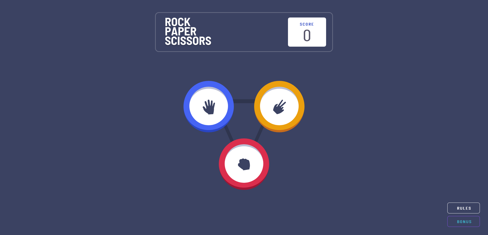
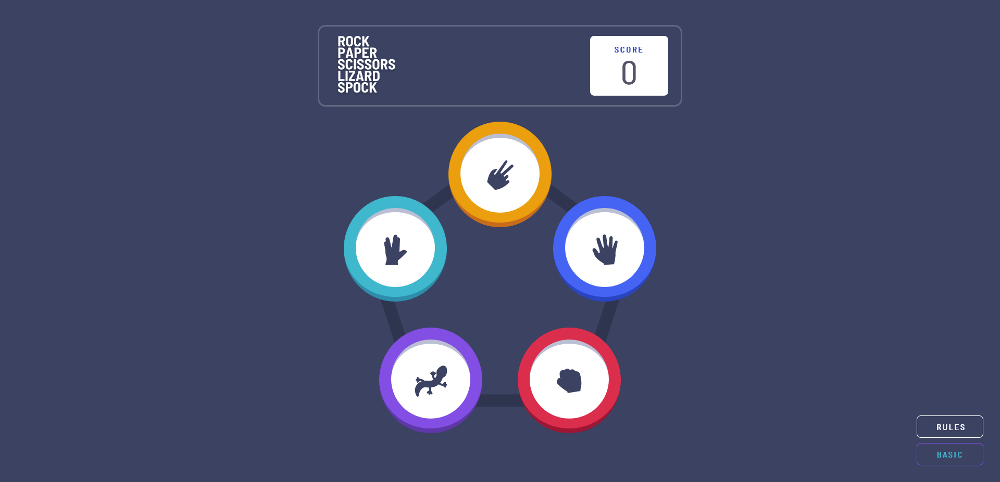
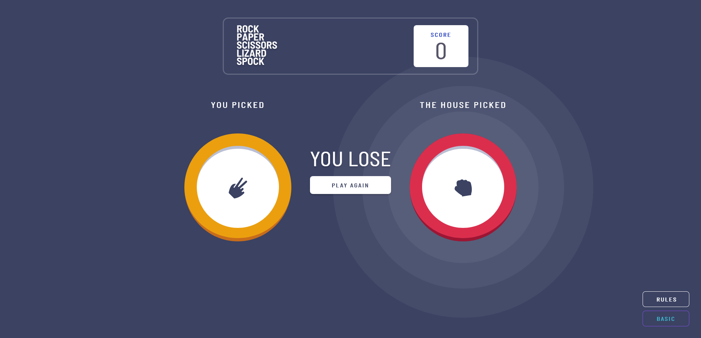
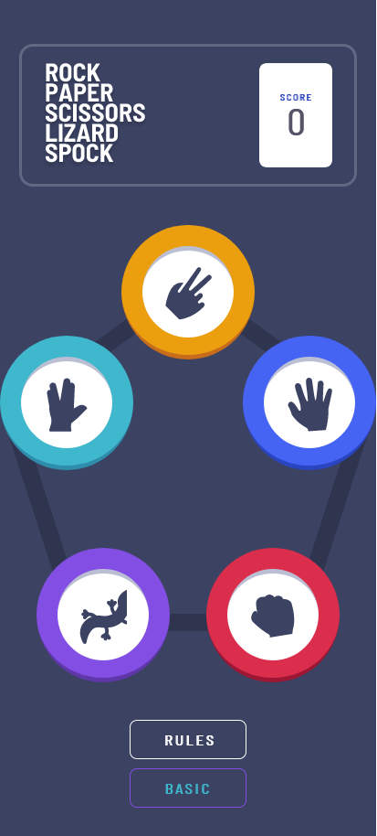
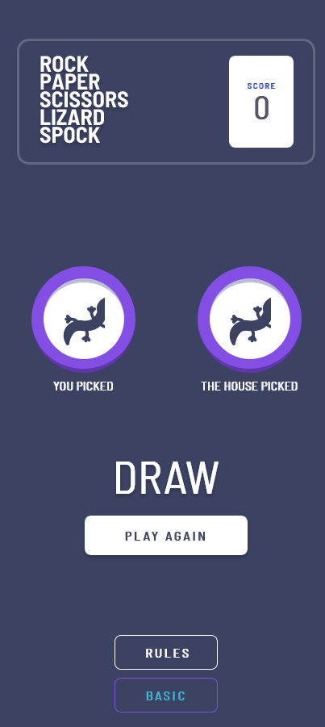

# Objective

Recreate the **Rock, Paper, Scissors** game with **Tailwind CSS**

The game will also include additional options.

[Live Link](https://antran1245.github.io/rock-paper-scissors/)

# Packages

- Tailwind CSS
- TypeScript
- PostCSS
- AutoPrefixer

# Features

- A button to switch between bonus version of the game.
- Animation on the winner choice in the game.

# Screenshots

<figure>
  
  <figcaption>Home Screen</figcaption>
</figure>

<figure>
  
  <figcaption>Bonus Home Screen</figcaption>
</figure>

<figure>
  
  <figcaption>When Picked</figcaption>
</figure>

<figure>
  
  
  <figcaption>Mobile Version</figcaption>
</figure>

# Credit

Project provided by [**Frontend Mentor**](https://www.frontendmentor.io/challenges/rock-paper-scissors-game-pTgwgvgH)
